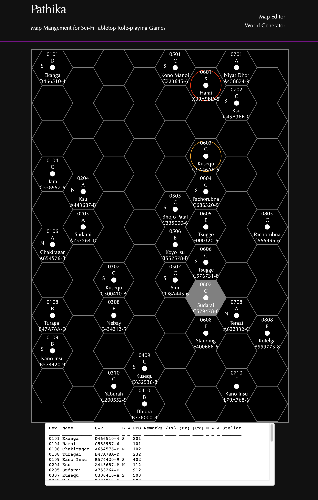
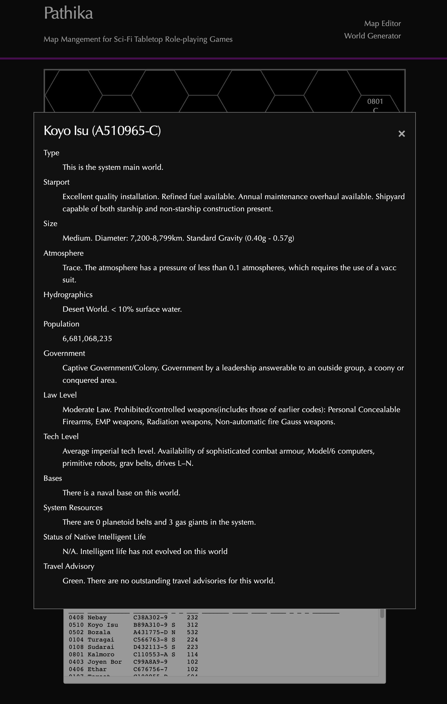
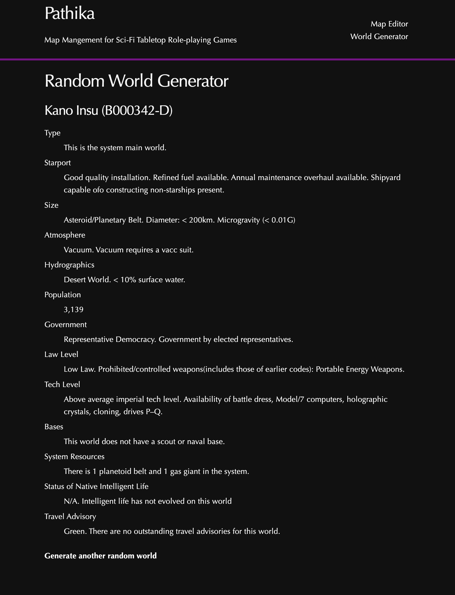

# Pathika

Pathika is a Phoenix project that aims to map creation and management tools for SciFi tabletop roleplaying game players, inspired by [Traveller Map](https://travellermap.com/?p=-0.433!0.5!2).

It is primarily intended as a learning experience as I explore Elixir, Phoenix and Phoenix LiveView.

## Features

* Generate random hex maps in accordance with the Traveller 5 ruleset and edit them in real-time.

  Map output is rendered as an SVG and provided in editable text format. Edits to the sector data text are parsed in real-time and valid changes are reflected on the map automatically.

  

* Translates Traveller's esoteric Universal World Profile strings into human readable descriptions of generated worlds accessible by clicking on a world on the map.

  

* Generate random, one-off worlds with descriptions.

  

## Planned Features

* Allow worlds to be added, removed and edited via forms by clicking on the map.
* User-facing error reporting when parsing sector data.
* Map persistence via Ecto and Postgres.
* User authentication. Log in, create, edit and save multiple maps, share them with other users.
* Pathfinding and other analysis tools. Filter worlds in a map by tech level, population, etc.
* Further Traveller 5 ruleset implementation such as Generators for Trade Goods, Encounters, and Characters.
* Discord bot integration via [Nostrum](https://github.com/Kraigie/nostrum). Access a saved map via chat commands.

## Installation
To start your Phoenix server:

  * Install dependencies with `mix deps.get`
  * Create and migrate your database with `mix ecto.setup`
  * Start Phoenix endpoint with `mix phx.server` or inside IEx with `iex -S mix phx.server`

Now you can visit [`localhost:4000`](http://localhost:4000) from your browser.

Ready to run in production? Please [check our deployment guides](https://hexdocs.pm/phoenix/deployment.html).

## Learn more

  * Official website: https://www.phoenixframework.org/
  * Guides: https://hexdocs.pm/phoenix/overview.html
  * Docs: https://hexdocs.pm/phoenix
  * Forum: https://elixirforum.com/c/phoenix-forum
  * Source: https://github.com/phoenixframework/phoenix
